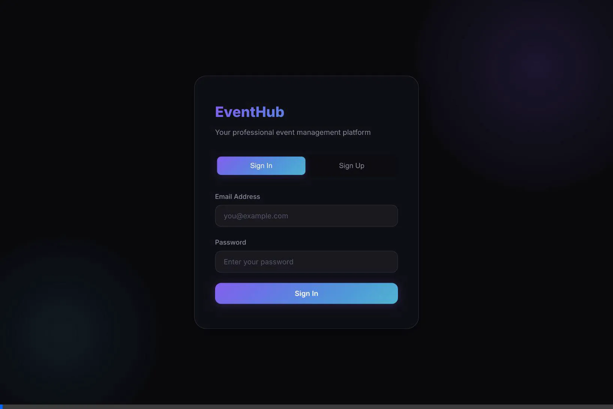
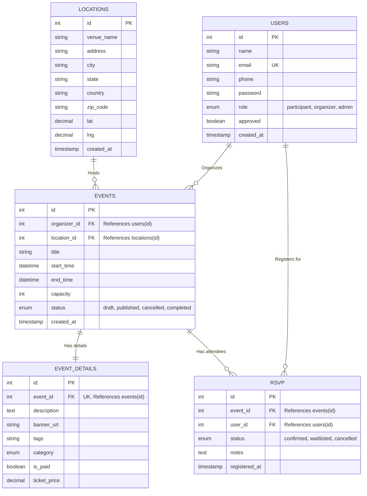

<div align="center">
  <h1>EventHub 🎟️</h1>
  <p>A professional, full-stack Event Management Application with a premium UI, robust role-based access control, and a seamless user experience.</p>
  
  
  
  
  
</div>

<br />

<div align="center">
  
</div>

---

## 📑 Table of Contents
- [Features](#features-)
- [Tech Stack](#tech-stack-)
- [Getting Started](#getting-started-)
  - [Prerequisites](#prerequisites)
  - [Installation](#installation)
- [Database Architecture](#database-architecture-)
- [Project Structure](#project-structure-)
- [License](#license-)

---

this was my first experience with AntiGravity and im absolutely awstruck with the result i think i can make wayy wayy better things with it

## Features ✨

### 🎨 Visual Polish & UI/UX
- **Premium Styling:** Dark-theme UI featuring glassmorphism, translucent backgrounds, and glowing animated borders.
- **Dynamic Interactions:** Micro-animations for event cards, floating orbs, and smooth hover state transitions.
- **Responsive Design:** Mobile-friendly layouts including a responsive sidebar navigation with darkened backdrops.

### 🛠️ Core Functionality
- **Authentication:** Secure user registration and login using JWT (JSON Web Tokens) and bcryptjs for password hashing.
- **Role-Based Access Control (RBAC):** Distinct roles for Participants, Organizers, and Admins.
- **Admin Dashboard:** Comprehensive admin capabilities to view registered users and approve pending organizer accounts.
- **Event Management:** Approved organizers can create, manage, and publish events.
- **RSVP System:** Participants can browse events, view details, and manage their RSVPs with dynamic waitlist tracking.
- **User Profiles:** Dedicated profile pages for users to view account status and registration details.

## Tech Stack 💻

- **Backend:** Node.js, Express.js
- **Database:** MySQL (using `mysql2/promise` for async/await support)
- **Frontend:** HTML5, CSS3 (Vanilla CSS with modern features), Vanilla JavaScript
- **Security:** `jsonwebtoken` (JWT), `bcryptjs`

## Getting Started 🚀

### Prerequisites
- [Node.js](https://nodejs.org/) installed
- [MySQL Server](https://www.mysql.com/) running

### Installation

1. **Clone the repository:**
   ```bash
   git clone https://github.com/ayushman1511/EventHub.git
   ```
2. **Navigate to the server directory:**
   ```bash
   cd dbms
   ```
3. **Install dependencies:**
   ```bash
   npm install
   ```
4. **Environment Setup:**
   - Copy `.env.example` to `.env` in the `dbms/` directory.
   - Configure your MySQL database credentials and provide a secret key for JWT in the `.env` file.
5. **Database Initialization:**
   - Run the provided `dbms/schema.sql` script in your MySQL environment to set up the `event_mgmt` database and its required tables.
6. **Start the Application:**
   ```bash
   npm run dev
   ```
   *The server will start, and the application will be accessible via your browser, typically at `http://localhost:3000`.*

## Database Architecture 🗄️

The database (`event_mgmt`) is highly normalized to ensure data integrity and efficient querying.



## Project Structure 📁

- `dbms/`: The main backend directory containing the Node.js server.
  - `server.js`: The monolithic Express API and application entry point.
  - `schema.sql`: Database schema definition.
  - `package.json`: Node dependencies and scripts.
  - `public/`: Contains the frontend assets (HTML, CSS, JS).

## License 📄
This project is licensed under the ISC License.
