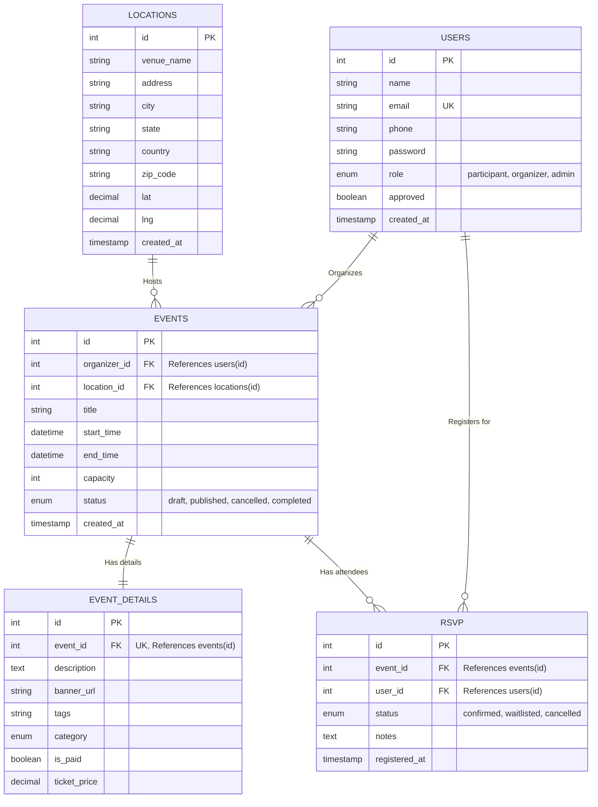

# Event Management App: Backend & Database Architecture

This document outlines the internal workings of the Event Management Platform, focusing extensively on the backend architecture, data storage, retrieval mechanisms, and the database schema.

## 1. Backend Architecture Overview

The backend is built as a robust, single-file monolithic RESTful API service. It relies on the following core technology stack:
*   **Runtime:** Node.js
*   **Framework:** Express.js
*   **Database:** MySQL (interfaced via `mysql2/promise` for asynchronous operations)
*   **Authentication:** JWT (JSON Web Tokens) for session management and `bcryptjs` for secure password hashing.

### Key Architectural Concepts
*   **Stateless API:** The server does not store user session data in memory. Authentication is stateless, managed via JWTs passed in the `Authorization` header of incoming requests.
*   **Role-Based Access Control (RBAC):** Middleware intercepts requests to ensure that users have the correct permissions (e.g., only `admin` can approve organizers; only `organizer` or `admin` can create events).
*   **Connection Pooling:** The database connection utilizes a pool (`mysql.createPool`) with a limit of 10 concurrent connections. This efficiently manages database connections, reducing the overhead of establishing a new connection for every request.

---

## 2. Data Storage & Retrieval Mechanisms

The application uses standard SQL constructs to store and retrieve data. The `mysql2` library's `promise` wrapper allows the backend to use `async/await` for clean, readable asynchronous database calls.

### Storage (Writing Data)
*   **Parameterized Queries:** To prevent SQL injection, all dynamic inputs are passed as parameters rather than concatenated directly into strings.
    ```javascript
    pool.execute('INSERT INTO users (name, email, ...) VALUES (?,?, ...)', [name, email, ...])
    ```
*   **Transactions:** For operations that affect multiple tables simultaneously, atomic transactions are used to ensure data consistency. For example, when creating a new event:
    1.  A dedicated connection is acquired from the pool: `const conn = await pool.getConnection();`
    2.  The transaction begins: `await conn.beginTransaction();`
    3.  The core event is inserted into the `events` table.
    4.  Extended details are inserted into the `event_details` table using the newly generated event ID.
    5.  If both succeed, the transaction is committed: `await conn.commit();`
    6.  If any step fails, changes are rolled back: `await conn.rollback();`

### Retrieval (Reading Data)
*   **Complex Joins:** To retrieve comprehensive datasets for the frontend, the backend relies on SQL `JOIN`s. For example, fetching a single event retrieves data from `events`, `users` (for the organizer name), `locations`, and `event_details`.
*   **Subqueries for Aggregations:** Dynamic calculations, like counting the current number of confirmed RSVPs for an event to determine waitlist status, are handled directly in the database using subqueries:
    ```sql
    (SELECT COUNT(*) FROM rsvp r WHERE r.event_id = e.id AND r.status = 'confirmed') AS confirmed_count
    ```

---

## 3. Database Schema

The database `event_mgmt` consists of 5 highly normalized tables.

### `users`
Stores all platform users. Roles dictate permissions.
*   **Fields:** `id`, `name`, `email` (UNIQUE), `phone`, `password` (Hashed), `role` (organizer/participant/admin), `approved` (Boolean, used for organizer onboarding workflows).

### `locations`
Stores physical or virtual venues for events.
*   **Fields:** `id`, `venue_name`, `address`, `city`, `state`, `country`, `zip_code`, `lat`, `lng`.

### `events`
The core representation of an event.
*   **Fields:** `id`, `organizer_id` (FK to users), `location_id` (FK to locations), `title`, `start_time`, `end_time`, `capacity`, `status` (draft/published/cancelled/completed).
*   *Note: Foreign keys are configured with `ON DELETE CASCADE`.*

### `event_details`
Extended properties mapped 1-to-1 with an event. Separating this improves performance when querying purely for core event listings.
*   **Fields:** `id`, `event_id` (UNIQUE, FK to events), `description`, `banner_url`, `tags`, `category`, `is_paid`, `ticket_price`.

### `rsvp`
A junction table mapping Users to Events they wish to attend.
*   **Fields:** `id`, `event_id` (FK to events), `user_id` (FK to users), `status` (confirmed/waitlisted/cancelled), `notes`, `registered_at`.
*   *Note: Includes a composite `UNIQUE` key on `(event_id, user_id)` to prevent double registrations.*

---

## 4. Entity-Relationship (ER) Diagram

Below is the ER Diagram visualizing how the tables are interconnected:



### Flow Example: User Registration & RSVP
1. **User Registration:** Client sends POST to `/auth/register`. The backend hashes the password and writes a new row to `users`.
2. **Event Creation (Organizer):** The backend opens a transaction, inserts a row into `events` using the user's ID as `organizer_id`, inserts into `event_details`, and commits.
3. **RSVP:** A participant attempts to register. The backend checks `capacity` against current confirmed RSVPs dynamically via a subquery. If under capacity, a new row is inserted into `rsvp` with status `confirmed`; otherwise, it is set to `waitlisted`.
